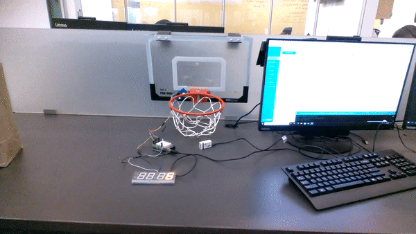
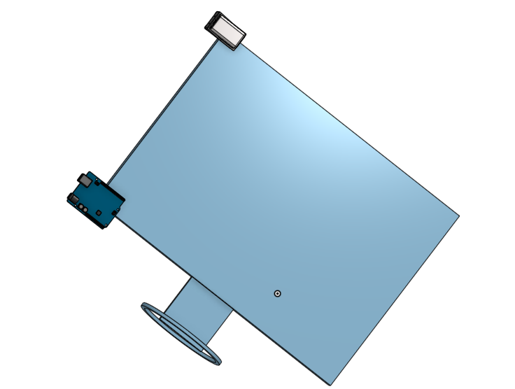

# BackBoard-Project

### Planning 
We are trying to make a working basketball backboard that counts made baskets everytime you shoot and make a shot. We will determine if we have solved the problem by weather or not we are able to have a working Seven Segment display that counts only the made baskets when we shoot on the hoop. We would like our backboard to be very accurate we do not want it counting misses as makes. We want to use a Seven Segment Display to show the total amount of made baskets and a Ultra Sonic Sensor to sense when the ball go's through the hoop. 


### Goals For Project
We want to build a fully functioning backboard with a ultrasonic sensor that counts made baskets. We also want to be able to understand code and how to use an ultrasonic sensor.


### Does if work?
Are Seven Segment Display works and the wiring and code is working but the Ultrasonic Sensor holder is in a wierd place causing the Ultrasonic Sensor to count irregularly or miss points all together.


### Video of it Working 


### Milestones
We printed our ultrasonic sensor holder and we are ready to finish our backboard.
We finished the code and wiring.
We made the Seven Segment display turn on and work.

### Parts used
We used these parts:
* Unltrasonic Sensor
* Seven Segment Display
* Arduino Uno
* Wires 
* Pre Built Basketball Backboard From Amazon
* 3D Prinited Ultrasonic Sensor Holder

### Problems
We had lots of code problems and wiring problems but we just used google and Mr Helmstetter to help us through.

### Link For onshape Document
(https://cvilleschools.onshape.com/documents/370ec0ce98278459c33782b4/w/71aaa089db0a2a1361a07167/e/d96bccb9132f9ffcce7fcd90)

### Psuedo Code
```c
#include <Adafruit_LEDBackpack.h>
#include <Wire.h> // Enable this line if using Arduino Uno, Mega, etc.
#include <Adafruit_GFX.h>
#include "Adafruit_LEDBackpack.h"

Adafruit_7segment matrix = Adafruit_7segment(); //This is the call sign for the seven segment display

int led = 8;

int counter = 0;
#define echoPin 2 // attach pin D2 Arduino to pin Echo of HC-SR04
#define trigPin 3 //attach pin D3 Arduino to pin Trig of HC-SR04

// defines variables
long duration; // variable for the duration of sound wave travel
int distance; // variable for the distance measurement
int oldDistance;//variable for the distance from the last loop


void setup() {
  pinMode(trigPin, OUTPUT); // Sets the trigPin as an OUTPUT
  pinMode(echoPin, INPUT); // Sets the echoPin as an INPUT
  Serial.begin(9600); // // Serial Communication is starting with 9600 of baudrate speed
  Serial.println("Ultrasonic Sensor HC-SR04 Test"); // print some text in Serial Monitor
  Serial.println("with Arduino UNO R3");
  pinMode(led, OUTPUT);
  Serial.println(counter);

#ifndef __AVR_ATtiny85__
  Serial.println("7 Segment Backpack Test");// Test to make sure display is connected properly
#endif
  matrix.begin(0x70);
}


void loop() {
  delay(100);
// This chunk gets the distance
  // Clears the trigPin condition
  digitalWrite(trigPin, LOW);
  delayMicroseconds(2);
  // Sets the trigPin HIGH (ACTIVE) for 10 microseconds
  digitalWrite(trigPin, HIGH);
  delay(10);
  digitalWrite(trigPin, LOW);
  // Reads the echoPin, returns the sound wave travel time in microseconds
  duration = pulseIn(echoPin, HIGH);
  // Calculating the distance
  distance = duration * 0.034 / 2; // Speed of sound wave divided by 2 (go and back)
  // Displays the distance on the Serial Monitor

  Serial.print("Distance: ");
  Serial.print(distance);

// This chunk tells what distances count as makes
  if (distance != 0 && distance < 100) {
    if (distance < 20 && oldDistance >= 20) {
      digitalWrite(led, HIGH);
      counter++;
    }
    if (distance > 20) {
      digitalWrite(led, LOW);

    }
    matrix.println(counter);
    matrix.writeDisplay();

    oldDistance = distance;

  }
  Serial.println(" cm");
  Serial.println(counter);


}

})
```
### Wiring for Basketball Backboard

### Image


### Cad for Assembly
We are starting our assembly for are backboard that we are using to hold the arduino and count the made baskets.


